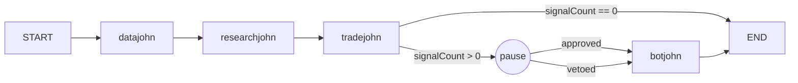
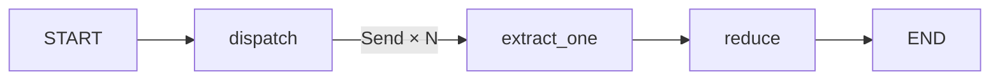

Two graphs are registered today. Add new flows in `src/agent/graphs/index.js` to get CLI and dashboard support for free.

## Cycle graph

`src/agent/graph.js`. The daily cycle runs through a `StateGraph` with durable Postgres checkpoints, an operator interrupt, and a conditional short-circuit.



<Info>
The HITL pause is configured with `interruptBefore: ['botjohn']`. When a run reaches that point, `compiled.invoke()` returns with `next = ['botjohn']` and the run's status in the trace bus flips to `awaiting_approval`.
</Info>

### State channels

```javascript src/agent/graph.js
const CycleState = Annotation.Root({
  cycleDate:      Annotation(),
  portfolioState: Annotation(),
  memoDir:        Annotation(),
  reportPath:     Annotation(),
  threadId:       Annotation(),
  workspace:      Annotation(),
  dataResult:     Annotation(),
  researchResult: Annotation(),
  tradeResult:    Annotation(),
  botResult:      Annotation(),
  signalCount:    Annotation(),
  runId:          Annotation(),
  approval:       Annotation(), // 'approved' | 'vetoed' | undefined
});
```

<Warning>
`notify` is a closure and is never stored in graph state. It travels through `config.configurable.notify`, which LangGraph passes to nodes but does not persist. If you add new non-serializable values, follow the same pattern.
</Warning>

### Checkpointing

`PostgresSaver` with a dedicated `langgraph` schema avoids colliding with OpenClaw's legacy `checkpoints` table in `public`:

```javascript
_checkpointer = PostgresSaver.fromConnString(uri, { schema: 'langgraph' });
await _checkpointer.setup();
```

### Resume

```javascript
const { resumeCycle } = require('./agent/graph');

await resumeCycle({
  threadId: 'thread-123',
  approval: 'approved', // or 'vetoed'
});
```

The resume path calls `compiled.updateState(config, { approval })` then `compiled.invoke(null, config)` to continue from the interrupt.

## PaperHunter fan-out

`src/agent/graphs/paperhunter.js`. Send-based fan-out runs all candidate papers in parallel.



```javascript Using the fan-out graph
const { runPaperHunt } = require('./agent/graphs/paperhunter');

const { results } = await runPaperHunt({
  candidates: [
    { candidate_id: 'abc', source_url: 'https://arxiv.org/abs/...' },
    { candidate_id: 'def', source_url: 'https://ssrn.com/...' },
  ],
  extract: async (candidate) => orchestrator._runPaperHunter(candidate),
});
```

<Note>
The `extract` function is non-serializable, so it is registered in a module-level map keyed by a token that lives in state. The token persists across checkpoints; the closure does not.
</Note>

Measured on the smoke test: 10 candidates with 150 ms stub extract run in ~185 ms (serial minimum ~1500 ms).

## Observability

Every node push-emits to the in-memory trace bus. The dashboard streams these over SSE on `/api/stream`. Set `LANGSMITH_API_KEY` in `.env` to additionally ship traces to LangSmith under project `fundjohn`.
